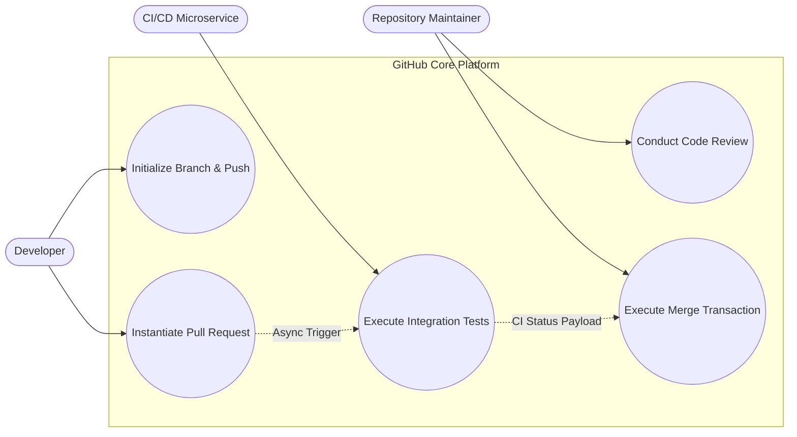
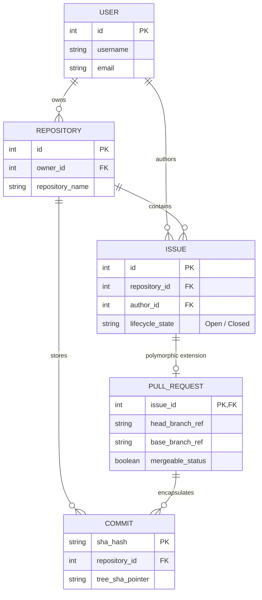
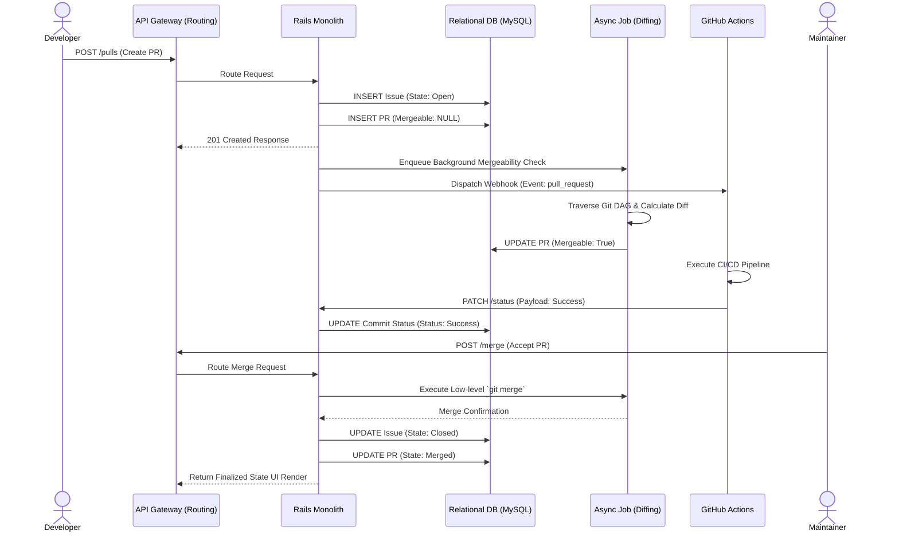
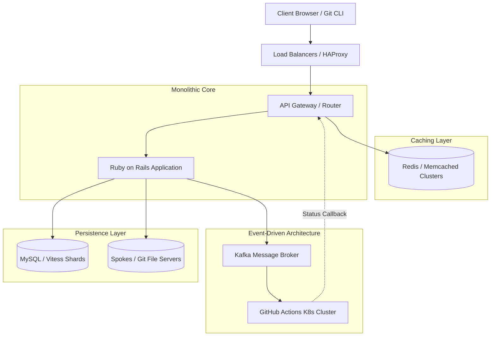

# Comprehensive Reverse Engineering of GitHub: Architecture, SCM, and Database Design

## Executive Summary
This repository contains a high-level architectural and data-level reverse engineering of the GitHub platform, grounded in the principles of Software Configuration Management (SCM) and distributed systems. By utilizing both top-down (UI-to-architecture) and bottom-up (GraphQL-to-database) analytical methodologies, we expose the underlying structural paradigms of the platform.

Key technical discoveries documented herein include:
* **SCM Engine & Git DAG:** The fundamental version control mechanism operating as a Content-Addressable File System, relying on mathematical traversal of a Directed Acyclic Graph (DAG) comprised of `Blob`, `Tree`, and `Commit` objects.
* **Architectural Evolution:** The transition from a monolithic Ruby on Rails core to an event-driven microservices ecosystem (e.g., GitHub Actions), heavily supported by a highly available caching layer (Redis/Memcached).
* **Database Polymorphism:** The relational database implementation where `Pull Requests` and `Issues` utilize Single Table Inheritance concepts, verifiable via GitHub's GraphQL API structure.
* **State Transitions:** The asynchronous, transactional database state changes that occur during a Pull Request lifecycle, orchestrated by background workers and external CI Webhooks.

---

## 1. Top-Down Discovery: Use Case & Behavioral Modeling

The following diagram illustrates the primary system actors and the core operational processing logic during the Pull Request lifecycle.

## 2. Bottom-Up Discovery: Polymorphic Data Architecture
By reverse-engineering the GraphQL API endpoints, we map the underlying relational database structure. Notice the polymorphic relationship where a Pull Request acts as a specialized extension of an Issue.

## 3. SCM Processing Logic: Pull Request State Transitions
This Sequence Diagram meticulously traces the database state transitions and the orchestration between the Rails Monolith, Background Workers (Mergeability checks), and GitHub Actions (CI).

## 4. High-Level System Component Architecture
The physical deployment and interaction of GitHub's distributed components, highlighting the centralized Rails monolith, caching optimization layers, and decoupled microservices.

